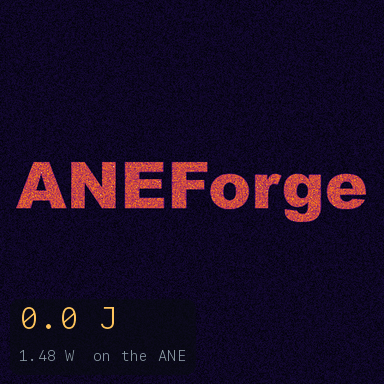
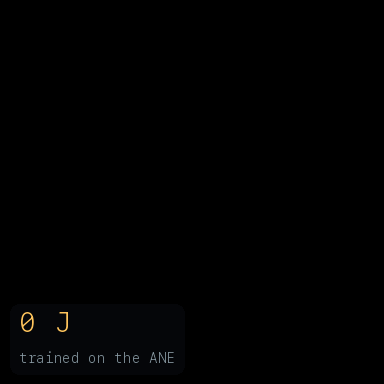

# ANEForge

[](https://aneforge.com)
[](https://github.com/sbryngelson/ANEForge/actions/workflows/ci.yml)
[](https://pypi.org/project/aneforge/)
[](https://aneforge.readthedocs.io)
[](https://arxiv.org/abs/2606.17090)
[](https://arxiv.org/abs/2606.22283)
[](https://doi.org/10.5281/zenodo.20672609)
[](LICENSE)
[](#install)

**Train and run neural networks directly on the Apple Neural Engine, from
Python, with no CoreML.**

<p align="center">
  
</p>

<p align="center">
  <sub>A transformer training from scratch on the engine (forward, backward, and
  Adam), then completing a prompt. Reproduce with <a href="examples/demo.py"><code>python examples/demo.py</code></a>.</sub>
</p>

Apple exposes the Neural Engine only through CoreML, for inference only.
CoreML decides whether your model lands on the engine or quietly falls back to the
CPU or GPU, and it gives you no way to train there. ANEForge skips it: it compiles
a tensor graph into one ANE program and dispatches that program through the same
private `aned` stack CoreML, MPSGraph, and Espresso use internally. From there:

- **Training runs on the engine.** The forward pass, the backward pass, and the Adam update all compile to ANE programs.
- A CNN trains from scratch on CIFAR-10 to 71%, on a chip Apple ships for inference only.
- **Hardware layers CoreML can't reach.** `af.sdpa` drives the engine's fused-attention layer directly, the one Apple's compiler decomposes and never emits; 18 other native layers (`argmax`, `topk`, `sort`, geometry) come the same way.
- **The engine, never a fallback.** A pretrained ResNet-18 runs end-to-end in 0.33 ms, matching the reference to cosine 1.0000, at a fraction of the GPU's energy (table below).
- **Cross-compilation for chips you don't own.** Lower and gate a graph for any of 28 ANE targets (M1-M5) from one machine, and estimate its latency without running it.

```python
import aneforge as af

x   = af.input((1, 3, 32, 32))             # a lazy graph input
y   = af.conv(x, W, pad=1).relu().mean((2, 3))
net = af.compile(y, compress="int8")       # graph -> one fused ANE program
out = net(image)                           # callable; runs on ANE silicon

# ...or load a pretrained model
enc = af.load(".../all-MiniLM-L6-v2")      # MiniLM sentence encoder
vec = enc(tokens)                          # on-device, cosine 1.0000 vs reference
```

A graph is built from 58 fused operators and 19 native bridge operators, lowered into a single program and reused across calls, with a near-70 us dispatch floor.

> **Status:** research project on Apple Silicon / macOS, verified on M5 Pro and M1
> Max. Relies on private framework symbols that may change without notice. Not
> affiliated with Apple.

## Install

Apple Silicon Mac, macOS 14+, Xcode command-line tools, Python 3.10+.

```sh
pip install aneforge
```

The `e5rt` dispatch shim links Apple frameworks, so it compiles from source on your Mac the first time you dispatch to the ANE (or ahead of time with `python -m aneforge.build`).
Optional extras: `pip install "aneforge[models]"` for the pretrained loaders (torch / torchvision / transformers).

For the examples, tests, and benchmarks, work from a checkout:

```sh
git clone https://github.com/sbryngelson/ANEForge.git
cd ANEForge
pip install -e ".[dev]"
PYTHONPATH=. python3 tests/op_smoketest.py    # compile + run each op on the ANE
```

Then browse [`examples/`](examples/), starting with
[`examples/quickstart.py`](examples/quickstart.py). To run an existing ONNX
model on the ANE, [`examples/onnx_import.py`](examples/onnx_import.py) imports
a `.onnx` classifier via `af.load_onnx` and validates it against onnxruntime
(cosine 1.0000); [`examples/onnx_finetune.py`](examples/onnx_finetune.py) imports
one as a frozen feature extractor and trains a new head on it entirely on the
ANE (transfer learning). For LLMs, [`examples/llm_chat.py`](examples/llm_chat.py)
is an interactive chat that streams a reply token-by-token on the ANE (resident
KV-cache decode, ~75 tok/s on Qwen3-0.6B), and
[`examples/llm_prefill.py`](examples/llm_prefill.py) loads a Llama/Qwen-class
model via `af.load_llm` and benchmarks prefill/decode (matching Hugging Face
logits). For retrieval,
[`examples/rag_embeddings.py`](examples/rag_embeddings.py) is a LangChain
`Embeddings` drop-in backed by the on-ANE encoder (4-5x faster than the GPU,
cosine 1.0000).

## How it compares

|                       | On the ANE        | No CoreML | Trains on it |
| --------------------- | :---------------: | :-------: | :----------: |
| CoreML / coremltools  | scheduler chooses | --        | no           |
| MLX, PyTorch (MPS)    | no (GPU)          | yes       | on the GPU   |
| **ANEForge**          | **yes (direct)**  | **yes**   | **yes**      |

CoreML is the only public door to the engine, and it only ever decides whether to
use it. ANEForge compiles to the engine directly, from an ordinary user process,
with no entitlement and without disabling system integrity protection.

## Measured

Single input, fp16, on an M5 Pro. The GPU baseline is PyTorch on Metal (MPS) at
fp16; energy is whole-package, read with `powermetrics`.

| Pretrained model | ANE     | GPU (fp16) | ANE energy | GPU energy |
| ---------------- | ------: | ---------: | ---------: | ---------: |
| ResNet-18        | 0.33 ms | 2.03 ms    | 2.2 mJ     | 35 mJ      |
| MiniLM encoder   | 0.53 ms | 1.92 ms    | 2.4 mJ     | 21 mJ      |
| ViT-B/16         | 18.3 ms | 15.9 ms    | 75 mJ      | 612 mJ     |

The engine is faster on the convolutional and encoder workloads and 8-16x more energy-efficient on all three, even on ViT-B/16, where the GPU edges it in latency.
Reproduce with [`bench/device_compare_wattcomplete.py`](bench/device_compare_wattcomplete.py) and [`bench/real_models_fp16.py`](bench/real_models_fp16.py); the full per-workload device map (16 classes, measured on M1 / M2 / M5) is in [`bench/results/`](bench/results/).

## A fluid simulation on the Neural Engine

<p align="center">
  
</p>

A passive dye is painted as the word ANEForge, and a 2-D incompressible Navier-Stokes flow (pseudo-spectral) stirs it into thin glowing filaments.
Every Fourier transform in the 2,200-step loop runs on the ANE, and the whole simulation costs about 9 J at the measured 1.48 W rail.
Reproduce with [`python examples/fluid_vorticity.py`](examples/fluid_vorticity.py).

## Reaction-diffusion on the Neural Engine

<p align="center">
  
</p>

The Gray-Scott equations grow Turing patterns from two diffusing, reacting chemicals (the mechanism behind seashell and animal-coat markings). The word ANEForge is seeded and blooms into a branching labyrinth.
The whole update is one program that re-dispatches every step: a 3x3 Laplacian as a native ANE conv, the reaction terms as elementwise ops, the periodic boundary wrapped in-graph from the field's own edges.
It is the real-space companion to the fluid demo above, which takes its derivatives spectrally (FFTs); this one uses a stencil (a conv).
Reproduce with [`python examples/reaction_diffusion.py`](examples/reaction_diffusion.py).

## A neural network that grows, trained on the Neural Engine

<p align="center">
  
</p>

A cellular-automaton update rule (a small CNN, shared across every cell) is trained so that a single live seed pixel grows into a target image, the way morphogenesis builds a body from one cell.
The forward pass through the rollout and the backward pass both run on the engine, gradient-checkpointed so the rollout's depth does not bound the compile (the optimizer runs host-side over the streamed gradients). So the rule is *learned* on the engine, not just run there, then dispatched step by step to grow the image, again on the engine.
Reproduce with [`python examples/train_neural_ca.py`](examples/train_neural_ca.py).

## What it does

- **Graph -> compile -> run.** 58 fused operators (conv/pool, `matmul`/`bmm`/`einsum`, activations, reductions, norms, softmax, attention, shape/geometry) into one program with int8/int4/fp16 weights, plus a bridge route for 19 native ops the public toolchain never emits.
- **Streaming weight compression.** int8, int4-LUT, or sparse weights streamed from the engine's dequant path (~4x smaller for int4), accuracy-gated.
- **On-device uint8 image input,** dequantized in-graph, so raw camera or video bytes feed the model directly.
- **Resident state.** KV-cache and optimizer state kept on the engine across steps via buffer aliasing (`share_buffer`).
- **Accuracy-preserving optimizer.** `af.tune` measures equivalent lowerings on the engine and returns the lossless pick.
- **Linear algebra and spectral methods.** `aneforge.linalg` and `aneforge.fft` as static-dataflow graphs.

## What runs

Pretrained models, each fused into one ANE program:

| Model              | Task                       | Fidelity vs reference   |
| ------------------ | -------------------------- | ----------------------- |
| ResNet-18          | ImageNet classification    | cosine 1.0000           |
| ViT-B/16           | vision transformer encoder | cosine 1.0000           |
| all-MiniLM-L6-v2   | sentence embedding         | cosine 1.0000           |
| ESPCN              | super-resolution           | runs end to end         |
| Stable Diffusion 1.5 | U-Net + VAE (per component) | U-Net 1.5%, VAE 4.4% rel. |

Trained from scratch on the engine: an MLP, a CNN (CIFAR-10 to 71%), a transformer block, a LLaMA-style block, and a character language model.
Operator coverage is tracked op by op across M1 to M5 in the [op catalog](docs/op-catalog.md), the exhaustive native-MIL-op x device table; [capabilities](docs/capabilities.md) has the dtype matrix and the known limits.

## Language models

Decoder LLMs run on the ANE from Hugging Face weights or GGUF — prefill plus resident-KV-cache decode, auto-segmented past the ~2 GB single-program ceiling:

| Model                  | What runs                          | Measured                          |
| ---------------------- | ---------------------------------- | --------------------------------- |
| Qwen3-0.6B / 8B        | dense decode, matches HF logits    | ~75 / ~7.5 tok/s decode           |
| Qwen3-8B + 0.6B draft  | speculative decoding, exact        | 2.28x (7.4 -> 16.8 tok/s)         |
| Qwen1.5-MoE-A2.7B      | sparse MoE, full model on pure ANE | coherent text, ~2 tok/s (int8)    |
| Qwen3.5 hybrid         | DeltaNet + gated attention         | fp16-safe (cosine 0.999999)       |

Speculative verify is near-free on the ANE (`verify(K) ≈ verify(1)`, decode is latency-bound); MoE decode at 30B scale is weight-bandwidth-bound. Full writeup in the [LLMs guide](docs/llm.md).

## Verify

The correctness corpus compiles and runs every op and kernel on the ANE, and serves as a reproducibility test:

```sh
PYTHONPATH=. python3 tests/run_corpus.py
PYTHONPATH=. python3 -m pytest tests/ -q
```

## Documentation

The manual is hosted at [aneforge.readthedocs.io](https://aneforge.readthedocs.io).
The API is documented in the module docstrings and demonstrated in [`examples/`](examples/).

The reverse engineering ANEForge builds on, the program-container format, the e5rt
dispatch path, and the engine internals down to the firmware, is collected in the
ANE guide at [ane-guide.readthedocs.io](https://ane-guide.readthedocs.io)
([arXiv:2606.22283](https://arxiv.org/abs/2606.22283)).

## Contributing

[`CONTRIBUTING.md`](CONTRIBUTING.md) has the bug-report checklist (include your chip and macOS version), the development setup, and where to start.
Report security issues privately per the [`SECURITY.md`](SECURITY.md) guidelines.

## License

[MIT](LICENSE). The Apple Neural Engine is proprietary hardware, and the framework symbols this project calls are private, undocumented, and may change at any time.
Nothing here is endorsed by, or constitutes an API contract from, Apple.
