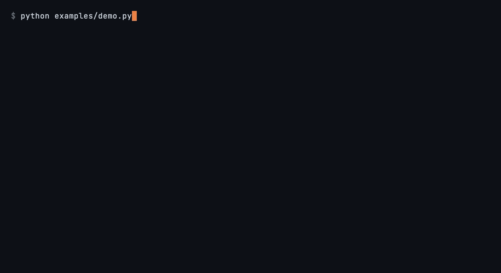
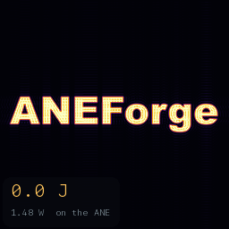

# ANEForge

[](https://github.com/sbryngelson/ANEForge/actions/workflows/ci.yml)
[](LICENSE)
[](#install)

**Train and run neural networks directly on the Apple Neural Engine, from
Python, with no CoreML.**

<p align="center">
  
</p>

<p align="center">
  <sub>A transformer training from scratch on the engine (forward, backward, and
  Adam), then completing a prompt. Reproduce with <a href="examples/demo.py"><code>python examples/demo.py</code></a>.</sub>
</p>

Apple exposes the Neural Engine only through CoreML, and only for inference.
CoreML decides whether your model lands on the engine or quietly falls back to the
CPU or GPU, and it gives you no way to train there. ANEForge skips it: it compiles
a tensor graph into one ANE program and dispatches that program through the same
private `aned` stack CoreML, MPSGraph, and Espresso use internally. From there:

- **Training runs on the engine.** The forward pass, the backward pass, and the
  Adam update all compile to ANE programs. A CNN trains from scratch on CIFAR-10 to
  71%, on a chip Apple ships for inference only.
- **Hardware layers CoreML can't reach.** `af.sdpa` drives the engine's
  fused-attention layer directly, the one Apple's compiler decomposes and never
  emits; 18 other native layers (`argmax`, `topk`, `sort`, geometry) come the same way.
- **The engine, never a fallback.** A pretrained ResNet-18 runs end to end in
  0.33 ms, matching reference to cosine 1.0000, at a fraction of the GPU's
  energy (table below).
- **Cross-compilation for chips you don't own.** Lower and gate a graph for any of
  28 ANE targets (M1-M5) from one machine, and estimate its latency without running it.

```python
import aneforge as af

x   = af.input((1, 3, 32, 32))             # a lazy graph input
y   = af.conv(x, W, pad=1).relu().mean((2, 3))
net = af.compile(y, compress="int8")       # graph -> one fused ANE program
out = net(image)                           # callable; runs on ANE silicon

# ...or load a pretrained model
enc = af.load(".../all-MiniLM-L6-v2")      # MiniLM sentence encoder
vec = enc(tokens)                          # on-device, cosine 1.0000 vs reference
```

A graph is built from 58 fused operators plus 19 native bridge operators, lowered
into one program and reused across calls, near a 70 us dispatch floor.

> **Status:** research project on Apple Silicon / macOS, verified on M5 Pro and M1
> Max. Relies on private framework symbols that may change without notice. Not
> affiliated with Apple.

## Install

Apple Silicon Mac, macOS 14+, Xcode command-line tools, Python 3.10+. ANEForge is
not on PyPI: the dispatch dylib links Apple frameworks and builds on your Mac, so
install from source.

```sh
git clone https://github.com/sbryngelson/ANEForge.git
cd ANEForge

# 1. Install the package (core dependency is just NumPy).
pip install -e .

# 2. Build the e5rt dispatch dylib (links Apple frameworks, so it builds on your Mac).
#    Loaded lazily on first dispatch; not tracked, so re-run after a clone or a pull
#    that touches aneforge/_lib/ane_e5rt_dispatch.mm.
sh aneforge/_lib/build.sh

# 3. Compile and run each op on the ANE.
PYTHONPATH=. python3 tests/op_smoketest.py
```

Optional extras: `pip install -e ".[models]"` (torch / torchvision / transformers
for the pretrained loaders) and `".[bench]"` (mlx / torch for the GPU-comparison
tools). Then browse [`examples/`](examples/), starting with
[`examples/quickstart.py`](examples/quickstart.py).

## How it compares

|                       | On the ANE        | No CoreML | Trains on it |
| --------------------- | :---------------: | :-------: | :----------: |
| CoreML / coremltools  | scheduler chooses | --        | no           |
| MLX, PyTorch (MPS)    | no (GPU)          | yes       | on the GPU   |
| **ANEForge**          | **yes (direct)**  | **yes**   | **yes**      |

CoreML is the only public door to the engine, and it only ever decides whether to
use it. ANEForge compiles to the engine directly, from an ordinary user process,
with no entitlement and without disabling system integrity protection.

## Measured

Single input, fp16, on an M5 Pro. The GPU baseline is PyTorch on Metal (MPS) at
fp16; energy is whole-package, read with `powermetrics`.

| Pretrained model | ANE     | GPU (fp16) | ANE energy | GPU energy |
| ---------------- | ------: | ---------: | ---------: | ---------: |
| ResNet-18        | 0.33 ms | 2.03 ms    | 2.2 mJ     | 35 mJ      |
| MiniLM encoder   | 0.53 ms | 1.92 ms    | 2.4 mJ     | 21 mJ      |
| ViT-B/16         | 18.3 ms | 15.9 ms    | 75 mJ      | 612 mJ     |

The engine is faster on the convolutional and encoder workloads and 8 to 16x more
energy efficient on all three, even on ViT-B/16 where the GPU edges it on latency.
Reproduce with
[`bench/device_compare_wattcomplete.py`](bench/device_compare_wattcomplete.py)
and [`bench/real_models_fp16.py`](bench/real_models_fp16.py); the full per-workload
device map (16 classes, measured on M1 / M2 / M5) is in
[`bench/results/`](bench/results/).

## A fluid simulation on the Neural Engine

<p align="center">
  
</p>

A passive dye is painted as the word ANEForge, and a 2-D incompressible
Navier-Stokes flow (pseudo-spectral) stirs it into thin glowing filaments. Every
Fourier transform in the 2,200-step loop runs on the ANE, and the whole
simulation costs about 9 J at the measured 1.48 W rail. Reproduce with
[`python examples/fluid_vorticity.py`](examples/fluid_vorticity.py).

## What it does

- **Graph -> compile -> run.** 58 fused operators (conv/pool, `matmul`/`bmm`/`einsum`,
  activations, reductions, norms, softmax, attention, shape/geometry) into one
  program with int8/int4/fp16 weights, plus a bridge route for 19 native ops the
  public toolchain never emits.
- **Streaming weight compression.** int8, int4-LUT, or sparse weights streamed from
  the engine's dequant path (~4x smaller for int4), accuracy-gated.
- **On-device uint8 image input,** dequantized in-graph, so raw camera or video
  bytes feed the model directly.
- **Resident state.** KV-cache and optimizer state kept on the engine across steps
  via buffer aliasing (`share_buffer`).
- **Accuracy-preserving optimizer.** `af.tune` measures equivalent lowerings on the
  engine and returns the lossless pick.
- **Linear algebra and spectral methods.** `aneforge.linalg` and `aneforge.fft` as
  static-dataflow graphs.

## What runs

Pretrained models, each fused into one ANE program:

| Model              | Task                       | Fidelity vs reference   |
| ------------------ | -------------------------- | ----------------------- |
| ResNet-18          | ImageNet classification    | cosine 1.0000           |
| ViT-B/16           | vision transformer encoder | cosine 1.0000           |
| all-MiniLM-L6-v2   | sentence embedding         | cosine 1.0000           |
| ESPCN              | super-resolution           | runs end to end         |
| Stable Diffusion 1.5 | U-Net + VAE (per component) | U-Net 1.5%, VAE 4.4% rel. |

Trained from scratch on the engine: an MLP, a CNN (CIFAR-10 to 71%), a transformer
block, a LLaMA-style block, and a character language model. Operator coverage is
tracked op by op across M1 to M5 in the [op catalog](docs/op-catalog.md), the
exhaustive native-MIL-op x device table; [capabilities](docs/capabilities.md) has
the dtype matrix and the known limits.

## Verify

The correctness corpus compiles and runs every op and kernel on the ANE, and is
the project's reproducibility gate:

```sh
KMP_DUPLICATE_LIB_OK=TRUE PYTHONPATH=. python3 tests/run_corpus.py
KMP_DUPLICATE_LIB_OK=TRUE PYTHONPATH=. python3 -m pytest tests/ -q
```

## Documentation

The manual lives in [`docs/`](docs/) (MkDocs; `pip install -r docs/requirements.txt`,
then `mkdocs serve`), starting at [`docs/index.md`](docs/index.md). The API is
documented in the module docstrings, and runnable usage in [`examples/`](examples/).

## Contributing

[`CONTRIBUTING.md`](CONTRIBUTING.md) has the bug-report checklist (include your
chip and macOS version), the development setup, and where to start. Report security
issues privately per [`SECURITY.md`](SECURITY.md).

## License

[MIT](LICENSE). The Apple Neural Engine is proprietary hardware, and the framework
symbols this project calls are private, undocumented, and may change at any time.
Nothing here is endorsed by, or constitutes an API contract from, Apple.
