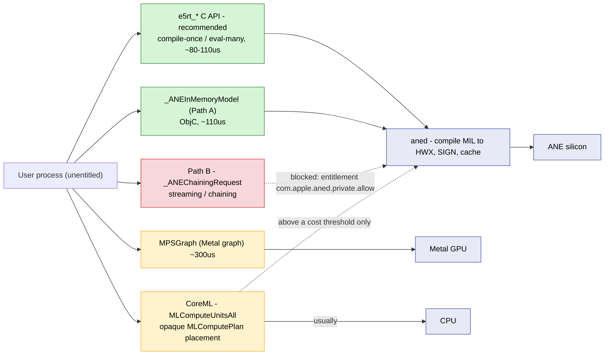

# Dispatch backends

ANEForge maps three working paths from a regular user process to the ANE silicon,
plus several surfaces that are reachable but blocked or unsuitable.

## Summary

| Path | Latency (p50, conv3x3 [1,256,32,32]) | Device | Status |
| --- | ---: | --- | --- |
| `e5rt_execution_stream_*` | ~80-110 us | ANE | **Recommended** |
| `_ANEInMemoryModel.evaluateWithQoS:` (Path A) | ~110 us | ANE | Stable |
| MPSGraph (`MPSGraphOptimizationLevel0`) | ~300 us | GPU | Available |
| CPU numpy fp16 | ~587 ms | CPU | Reference |
| Path B (`_ANESharedEvents` / `_ANEChainingRequest`) | - | - | **Blocked** (entitlement) |
| CoreML `MLComputeUnitsAll` | varies | CPU usually | Not viable for direct ANE |

Where each route lands (green = reaches the ANE without an entitlement; amber = conditional or
lands on another device; red = blocked):



The two green routes (e5rt, Path A) are the working paths; both converge
on `aned` (which compiles, signs, and caches the HWX) and reach the same silicon.

## e5rt - the fast path

Built on Espresso.framework's `e5rt_*` C API, all resolvable via `dlsym` from an
unentitled process. The flow is compile-once / eval-many: compile a MIL program to a
program library, retain the `main` function, bind input/output buffers, then encode
and execute on a stream. A stable program handle stays resident in `aned` across
submissions, so per-call cost is `input memcpy + execute + output memcpy`.

Full call sequence and the `e5rt_*` C ABI are in
[e5rt-dispatch-reference.md](e5rt-dispatch-reference.md).

### When to use it

- Compile-once, eval-many workloads.
- Inference hot loops where each call's shape is fixed.
- Multi-op pipelines (encode multiple ops onto a single stream).

### Constraints

- Shapes are baked into the compiled program. Each new shape pays a fresh compile
  (~750 ms one-time).
- Cross-process sharing works end-to-end. Bundle handoff is the ~30 ms warm-load
  path and requires the master and worker to share a codesign identity (same binary,
  `posix_spawn`'d children - `fork()` does not work, Espresso is
  libdispatch-fork-unsafe). Heterogeneous binaries recompile the MIL (~750 ms cold,
  ~30 ms warm aned cache). Cross-process tensor handoff via IOSurface runs the data
  plane with no memcpy at ~70 us per surface. See
  [e5rt-dispatch-reference.md](e5rt-dispatch-reference.md).

## Path A - `_ANEInMemoryModel`

The canonical Objective-C surface ANEForge's higher-level frontend uses. Public API
of `AppleNeuralEngine.framework`, callable without entitlement:

```objc
desc  = [_ANEInMemoryModelDescriptor modelWithMILText:milData
                                              weights:weights
                                         optionsPlist:nil];
model = [_ANEInMemoryModel inMemoryModelWithDescriptor:desc];
[model compileWithQoS:33 options:opts error:&err];
[model loadWithQoS:33    options:opts error:&err];
[model evaluateWithQoS:33 options:opts request:req error:&err];
```

`compile + load` cost: ~38 ms one-time per shape. Eval is ~110 us at the canonical
conv shape - the same hardware path as e5rt, reached through ObjC rather than C.

Use Path A when you need behavior the e5rt wrapper does not yet expose (e.g.,
multi-output programs the e5rt wrapper handles differently, or compile-options keys
the e5rt API does not surface).

## What about CoreML?

CoreML reaches the same hardware but routes most workloads to CPU. Apple's
`MLComputePlan` API (public macOS 26.5) reports the per-op preferred device for any
compiled `.mlmodelc`. Across a 451-program audit of ANEForge's fuzzer corpus:

- 0% of programs had any non-trivial op preferred to the ANE by Apple's compiler.
- 88.9% routed every real compute op to CPU per Apple's policy.
- Routing flips ANE-ward only above a workload-cost threshold (e.g., for conv3x3,
  the knee is between `[1,128,32,32]` (CPU) and `[1,256,32,32]` (ANE)).

A powermetrics audit shows ANEForge's direct paths bypass this heuristic: real power
draws on the ANE rail even for the ops `MLComputePlan` flags as CPU-only. So
ANEForge's direct paths (`_ANEInMemoryModel` and `e5rt`) reach the ANE on smaller
workloads where CoreML would keep things on CPU.

`MLComputePlan` is still useful as an audit oracle: it asks Apple's compiler
whether a compiled MIL has any ANE-preferred ops, catching silent CPU
dispatches in a CoreML pipeline. ANEForge uses it offline to audit its corpus,
not as a dispatch path - the direct `e5rt` / Path A routes reach the ANE
regardless of what Apple's routing heuristic prefers.

## Path B - blocked

`_ANESharedEvents`, `_ANEChainingRequest`, and the always-zero
`intermediateBufferHandle` - collectively "Path B" - gate streaming, chained
execution, and direct IOSurface ownership behind the `com.apple.aned.private.allow`
entitlement. Apple uses Path B internally; third parties cannot.

ANEForge reproduces the Path-B behavior that mattered for autonomy - a host-free
dispatch loop - on the e5rt path in bounded form (one `execute_multi` drives K
on-engine steps), and it is performance-neutral, so the entitlement is no reason
to want it. See
[e5rt-dispatch-reference.md](e5rt-dispatch-reference.md#251-persistent-on-device-state-via-output-input-buffer-aliasing).

## MPSGraph

Public Metal-based graph API. It can in principle route to ANE via private
compilation-descriptor selectors, but for most workloads it keeps execution on the
Metal GPU. ANEForge does not use MPSGraph as a dispatch backend, but it is a useful
verified GPU baseline for cross-device benchmarking, and the
`EspressoANEIOSurface metalBufferWithDevice:` zero-copy primitive is available for a
future hybrid CPU/GPU/ANE pipeline.

## Choosing a path

| You need | Use |
| --- | --- |
| Hot-loop inference at fixed shape | **e5rt** (`af.compile` -> reuse the `net`) |
| Quick try from Python | `import aneforge as af`; build a graph, `af.compile`, call `net(x)` |
| Single-shot inference, don't care about latency | Either green path |
| Streaming inference with KV-cache | e5rt + paired state tensors (see [capabilities.md](capabilities.md)) |
| Multi-op compiled pipeline | e5rt with multiple ops on one stream |
| Routing-truth audit | `MLComputePlan` over a compiled `.mlmodelc` (offline oracle) |
| Hardware-counter probe of which silicon ran | `sudo powermetrics --samplers ane_power,cpu_power,gpu_power` |
