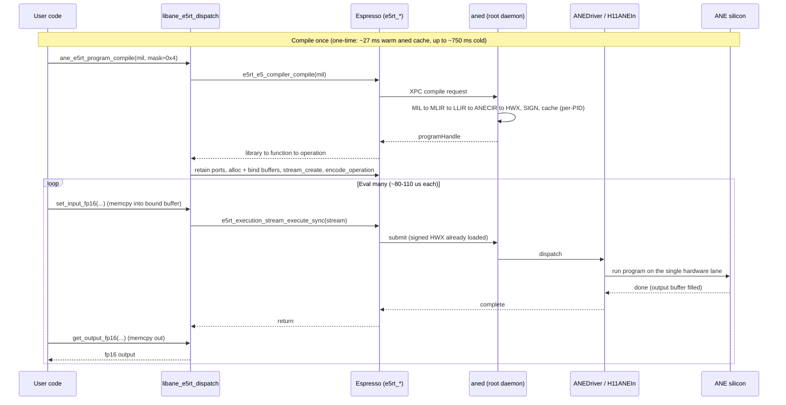

# e5rt dispatch reference

The complete reference for the `e5rt` dispatch path: the unentitled, CoreML-free
route that compiles a MIL program and runs it on the ANE through
`Espresso.framework`'s `e5rt_*` C API. This is the fast path `aneforge` uses for
every fused program, reachable from an ordinary user process with only
`dlopen` + `dlsym` (no entitlement, no `.tbd` linkage).

Two surfaces are documented here:

1. The underlying `e5rt_*` symbols in `Espresso.framework` and the exact
   ordered sequence to drive them (the "what Apple exposes" layer).
2. The project's stable C ABI (`ane_e5rt_*` in
   `aneforge/_lib/ane_e5rt_dispatch.mm`, built into
   `libane_e5rt_dispatch.dylib`) that wraps those symbols into a
   compile-once/eval-many object - the layer `aneforge/_runtime.py` calls.

For the dispatch-path matrix (e5rt vs Path A vs Path B vs MPSGraph vs CoreML), see
[dispatch.md](dispatch.md).

> Status: verified end-to-end on macOS 26.5 / M5 Pro (`h17s`). The core surface
> (compile, bind, encode, `execute_sync`) is production-grade; the multi-op,
> async, and cross-process surfaces are marked **experimental** (callable C
> surface that the Python frontend does not bind) where they are research-grade
> or partly inferred.

---

## 1. What the path is

- Unentitled. Everything below resolves via `dlopen` of
  `/System/Library/PrivateFrameworks/Espresso.framework/Espresso` + `dlsym`. The
  system log shows the dispatch going through `aned` -> `ANECompilerService`
  (MIL -> HWX) -> `ANEDriver` -> `H11ANEIn` with `csIdentity =
  ThirdPartyAppUsingANE`: no entitlement, a real assigned `programHandle`,
  ~48 KiB wired memory per model, on the `qos=21` lane.
- Compile-once / eval-many. The single `compile` call is where the whole
  4-IR pipeline (`MIL -> MLIR -> LLIR -> ANECIR -> HWX`) and HWX signing happen
  inside `aned` (~27 ms on this host). Every subsequent eval is bind -> encode ->
  `execute_sync`, ~80 us.
- Device selection is a bitmask: `0x1` = BNNS/CPU, `0x2` = MPSGraph/GPU,
  `0x4` = ANE. `aneforge` sets `0x4`. With multiple bits the runtime auto-selects
  (falling back to BNNS if the ANE compile fails); verify the choice via
  `SelectedBackend = string("ane")` in the produced bundle's `analytics.mil`.

---

## 2. The underlying `e5rt_*` call sequence

The exact ordered sequence the dylib runs (see `compile_and_build_op` and the
encode/execute helpers in `ane_e5rt_dispatch.mm`). About 30 of the 235 exported
`e5rt_*` symbols are used; their function-pointer typedefs are in
`aneforge/_lib/e5rt_api.h`.

One call is a single one-time compile (the 4-IR pipeline and HWX signing inside
`aned`), then a cheap per-inference eval loop.



### 2.1 Compile: MIL text -> signed HWX -> an executable operation

```c
e5rt_e5_compiler_config_options_create(&config);
e5rt_e5_compiler_config_options_set_cache_bundle_location(config, cache_dir);
e5rt_e5_compiler_create_with_config(&compiler, config);

e5rt_e5_compiler_options_create(&options);
e5rt_e5_compiler_options_set_compute_device_types_mask(options, 0x4);  // 0x4 = ANE
e5rt_e5_compiler_options_set_force_recompilation(options, 1);
e5rt_e5_compiler_options_set_segmenter(options, "graph");
e5rt_e5_compiler_compile(compiler, mil_path, options, &library);       // aned: MIL->...->HWX, signs + caches per-PID

e5rt_program_library_retain_program_function(library, "main", &function);
e5rt_precompiled_compute_op_create_options_create_with_program_function(&op_options, function);
e5rt_precompiled_compute_op_create_options_set_operation_name(op_options, "main");
e5rt_precompiled_compute_op_create_options_set_allocate_intermediate_buffers(op_options, 1);
e5rt_execution_stream_operation_create_precompiled_compute_operation_with_options(&operation, op_options);
```

The compiler/config/options can be released once `operation` exists.

### 2.2 Bind I/O buffers (per input and output port)

```c
e5rt_execution_stream_operation_retain_input_port(operation, port_name, &port);   // outputs: ..._retain_output_port
e5rt_buffer_object_alloc(&buffer, n_bytes, 0);     // type 0 = plain CPU data ptr (0/1/2 valid)
e5rt_buffer_object_get_data_ptr(buffer, &ptr);     // memcpy fp16 inputs into *ptr
e5rt_io_port_bind_buffer_object(port, buffer);
```

### 2.3 Build the stream and encode

```c
e5rt_execution_stream_create(&stream);

// optional happens-before plumbing:
e5rt_async_event_create(&evt, name, 0);                              // 3 args; NULL name errors
e5rt_execution_stream_operation_bind_completion_event(operation, evt);

// re-encode path only (a stream that was already used):
e5rt_execution_stream_reset(stream);                                 // rejects a fresh stream
e5rt_execution_stream_operation_prepare_op_for_encode(operation);    // only legal on already-encoded ops

e5rt_execution_stream_encode_operation(stream, operation);           // once per op, in submission order
```

### 2.4 Execute and read

```c
e5rt_execution_stream_execute_sync(stream);                  // the production path; serializes encoded ops in order
// or async:
e5rt_execution_stream_submit_async(stream, ^{ /* completion */ });   // 2nd arg is an ObjC block, objc_retain'd

// read fp16 back through the output buffer's data ptr; async path waits first:
e5rt_async_event_sync_wait(final_event);
e5rt_async_event_get_last_signaled_value(evt, &value);
```

### 2.5 Multi-op extras (chaining, buffer sharing)

```c
e5rt_execution_stream_operation_bind_dependent_events(dst_op, events, 1);  // src completion-event -> dst dependency (A->B)
e5rt_io_port_bind_buffer_object(dst_port, src_buffer);                     // share a buffer between ops (zero-copy)
```

#### 2.5.1 Persistent on-device state via output->input buffer aliasing

`share_buffer` can alias an op's output port onto its own (or a downstream op's)
input port before the first `execute`. With that alias in place, one
`execute_sync` per step reads from and writes back to the same resident
buffer, with no host round-trip between steps. The sequence is:

1. Compile the op and bind ports as usual.
2. Call `e5rt_io_port_bind_buffer_object` (or `ane_e5rt_program_share_buffer` at
   the project C ABI layer) to wire the output port to the same buffer as the
   input port.
3. Seed the buffer once from the host (`get_data_ptr` -> `memcpy`).
4. Loop `execute_sync` with no intervening `set_input`/`get_output`.
5. Read back via `get_data_ptr` only at checkpoints.

This technique is reachable without an entitlement and is wired into the frontend:

- `aneforge/_runtime.py` `Program` gained `share_buffer(src_op, src_port,
  dst_op, dst_port)` plus granular `set_input` / `execute` / `read_output`.
- `aneforge/_compile.py` gained `compile_multi(outs)` and a `MultiModel` class
  that lowers a graph with N output tensors into one fused program with N named
  output ports.
- `aneforge/autograd.py` `Trainer(resident_state=True)` assembles the entire
  training step - forward + backward + per-param optimizer update - as one fused
  multi-output e5rt program, then aliases each state tensor's output port onto its
  own input port via `share_buffer`. Weights and Adam moments stay resident on the
  ANE across steps; the host supplies only the minibatch (`x`, `target`) and the
  scalar `lr_t` per step, and reads weights back only at epoch checkpoints.

Demonstrated result: a 784->256->10 GELU MLP (Adam) trained to 97.79% test
accuracy on full MNIST with all 12 state tensors (4 params x {w, m, v}) resident
across ~2340 steps, in ~1.0 s (the prior host-shuttle path was ~4 s). No compile
wall at this scale. Example: `examples/train_mnist_mlp.py`. Tests:
`test_compile_multi_two_outputs`, `test_resident_sgd_matches_host_reference`,
`test_resident_adam_trains_subset_and_state_stays_resident` in
`tests/test_autograd.py`.

Caveats. fp16 storage means exact integer values are only representable to
~2048; the device is a single lane (latency/bandwidth, not parallelism). Trainable op
coverage spans MLP, CNN, and transformer-block models - matmul-family plus
structural VJPs (transpose/reshape/concat/slice), conv grad-wrt-input, and
avg_pool/max_pool - with the resident-state path demonstrated on all three.

Multi-step host-free dispatch - reachable without an entitlement, and not a bottleneck.
`execute_multi` encodes K ops into one stream and runs them
under a single `execute_sync`, so one host dispatch drives K on-engine steps:
K copies of an aliased step, chained `op_i.out -> op_{i+1}.in` by `share_buffer`,
seeded once, advance the accumulator to exactly K for K up to 100 (ceiling
~110-120, the `aned` per-PID program cap). This needs no Path B and no
entitlement. It is also performance-neutral: one `execute_multi` over 64 ops
(66 ms median) is no faster than 64 separate `execute` calls (60 ms) - on the
resident-buffer path `execute_sync` over already-bound buffers is nearly free,
so per-step host dispatch is not a measurable cost (~0.93 ms/step intrinsic,
single lane). The only remaining inaccessible case is unbounded zero-host
autonomy (the engine self-looping with no host call ever), which is
entitlement-gated; by this measurement it would not run these workloads
any faster.

### 2.6 Release (reverse order)

`operation` -> `op_options` -> `function` -> `library` -> `buffer_object` ->
`io_port` -> `async_event` -> `stream`, each via its `e5rt_*_release`.

---

## 3. ABI discoveries (the non-obvious calling conventions)

Recovered empirically; getting them wrong returns specific errors:

- Every `create` entry point is out-pointer-first: `(void out,
  payload...)`. Reversed args give `Invalid E5 path specified. @
  GetE5PathFromCompositeBundle` or `Cannot provide program function as nullptr. @
  Create`.
- `e5rt_async_event_create` takes three args `(out, name, initial_value)`.
  A NULL name returns `Invalid Function Argument: eventName is NULL`.
- `e5rt_execution_stream_submit_async` takes two args, the second an
  Objective-C completion block that is `objc_retain`'d unconditionally; passing
  NULL crashes in `objc_retain`. (The dylib provides
  `ane_e5rt_make_completion_block` to build one from a C callback.)
- `e5rt_buffer_object_alloc(out, size, type)` is out-first; types `0/1/2`
  are valid (anything else: `Invalid BufferType @ AllocMemory`). Type `0` gives a
  buffer whose `get_data_ptr` is a plain CPU virtual address.
- `compute_device_types_mask`: `0x1` bnns / `0x2` mps_graph / `0x4` ane;
  `0x3` -> bnns wins; `0x5`/`0x6`/`0x7` -> ane (with `0x7` falling back to bnns if
  the ANE compile fails).

---

## 4. The project C ABI (`ane_e5rt_*`)

`aneforge/_lib/ane_e5rt_dispatch.mm` wraps the sequence above into a
compile-once/eval-many `ane_e5rt_program_t`, built into
`aneforge/_lib/libane_e5rt_dispatch.dylib`. `aneforge/_runtime.py` binds the
subset the package uses (compile / set_input / execute / get_output / release);
the full ABI follows.

### 4.1 Single-op (the lean, production subset)

```c
ane_e5rt_program_t *ane_e5rt_program_compile(
    const char *mil_path, const char *cache_dir, uint64_t device_mask,
    const char *const *input_names,  const size_t *input_sizes,  size_t n_inputs,
    const char *const *output_names, const size_t *output_sizes, size_t n_outputs);
int  ane_e5rt_program_set_input_fp16 (ane_e5rt_program_t*, const char *port, const uint16_t *data, size_t n_elems);
int  ane_e5rt_program_execute        (ane_e5rt_program_t*);                     // execute_sync
int  ane_e5rt_program_get_output_fp16(ane_e5rt_program_t*, const char *port, uint16_t *dest, size_t n_elems);
void ane_e5rt_program_release        (ane_e5rt_program_t*);
```

### 4.2 Multi-op stream (experimental)

Encode several ops onto one stream; chain them with events; share buffers
op-to-op for zero-copy hand-off.

```c
int    ane_e5rt_program_add_op(ane_e5rt_program_t*, const char *mil_path,
           const char *input_name, size_t input_size, const char *output_name, size_t output_size);
int    ane_e5rt_program_set_input_fp16_op (ane_e5rt_program_t*, size_t op_idx, const char *port, const uint16_t *data, size_t n);
int    ane_e5rt_program_get_output_fp16_op(ane_e5rt_program_t*, size_t op_idx, const char *port, uint16_t *dest, size_t n);
int    ane_e5rt_program_execute_multi(ane_e5rt_program_t*);                     // one execute_sync over all encoded ops
size_t ane_e5rt_program_get_op_count (ane_e5rt_program_t*);
int    ane_e5rt_program_chain_ops    (ane_e5rt_program_t*, size_t src_op_idx, size_t dst_op_idx, const char *event_name);
int    ane_e5rt_program_share_buffer (ane_e5rt_program_t*, size_t src_op_idx, const char *src_out_port,
                                       size_t dst_op_idx, const char *dst_in_port);
int    ane_e5rt_program_get_chain_event_last_signaled(ane_e5rt_program_t*, size_t op_idx, uint64_t *out);
```

### 4.3 Async completion (experimental)

```c
int   ane_e5rt_program_execute_async         (ane_e5rt_program_t*);             // submit_async + completion block
int   ane_e5rt_program_wait_for_completion   (ane_e5rt_program_t*);             // sync_wait on the final event
int   ane_e5rt_program_get_final_event_signaled(ane_e5rt_program_t*, uint64_t *before, uint64_t *after);
void *ane_e5rt_make_completion_block(ane_e5rt_completion_cb_t cb, void *ctx);
void  ane_e5rt_free_completion_block(void *block);
```

### 4.4 Cross-process tensor hand-off (IOSurface)

In-process zero-copy between ops is `ane_e5rt_program_share_buffer` (section 4.2).
Cross-process tensor hand-off uses an IOSurface passed by Mach port
(`bootstrap_register`), ~70 us. It exists because a compiled program is not loadable in a
fresh process (section 5), so a persistent compiled worker is fed inputs and returns outputs
by IOSurface.

---

## 5. Operational constraints (the ones that bite)

1. Compile and dispatch must be in the same process. The signed HWX lives
   only in `aned`'s per-PID cache; loading a previously compiled bundle in a
   fresh process fails with `ANE model load has failed ... Must re-compile the
   E5 bundle`. Cross-process reuse needs same-codesign-identity `posix_spawn`'d
   children; `fork()` SIGSEGVs (Espresso/libdispatch is fork-unsafe).
2. `execute_sync` serializes all encoded ops in a stream, regardless of
   `bind_dependent_events`. Multiple `encode_operation` calls before one
   `execute_sync` run in submission order.
3. Completion events only increment on `submit_async`. `bind_completion_event`
   / `bind_dependent_events` accept correct parameters, but a `last_signaled_value`
   does not advance under `execute_sync`. The dependency-graph machinery is wired
   and confirmed via the async path; full happens-before enforcement under
   `execute_sync` is thus partly inferred, not observed.
4. ~128 loaded programs per PID (the 129th load fails; `release()` frees a
   slot), and the in-flight depth is capped at 127
   (`dispatch_semaphore_create(127)` in the runtime).
5. The two locks still apply. You can only submit MIL or single-procedure
   ANECIR netplist (the parser gate), and only `aned`-signed HWX loads (the
   kernel signature gate, error `0xe00002e2`). e5rt does not change either.

---

## 6. Where this lives in the repo

| Layer | File |
| --- | --- |
| Underlying `e5rt_*` symbol typedefs | `aneforge/_lib/e5rt_api.h` |
| Project C ABI + the call sequence | `aneforge/_lib/ane_e5rt_dispatch.mm` -> `libane_e5rt_dispatch.dylib` |
| `aneforge` runtime wrapper | `aneforge/_runtime.py` |

The build command for the dylib is in the repo `README.md` (Install section 2).
